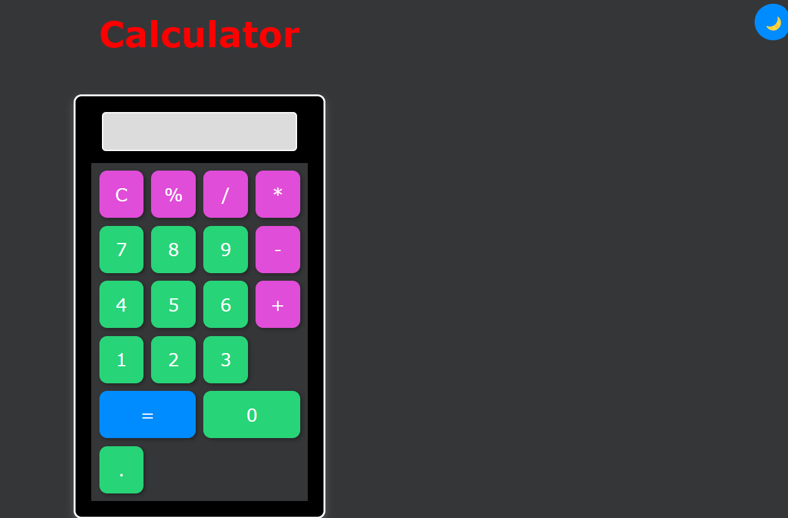

# 🖩 Calculator  

A simple, interactive, and stylish calculator built using **HTML, CSS, and JavaScript**. It supports basic arithmetic operations and features smooth animations along with a dark/light mode toggle.  

## 🔥 Features  
✅ **Basic Operations**: Addition, Subtraction, Multiplication, and Division  
✅ **Dark & Light Mode**: Easily switch themes with a toggle button  
✅ **Smooth Animations**: Buttons and UI elements have interactive hover effects  
✅ **Responsive Design**: Works seamlessly on desktop and mobile devices  

## 🎥 Demo  
🔗 [Live Preview][https://rasool321.github.io/Calculator/]  

## 📸 Screenshots  
### **Dark Mode**  
  

### **Light Mode**  
  

## 🛠️ Technologies Used  
- **HTML** → For structuring the calculator  
- **CSS** → For styling and animations  
- **JavaScript** → For interactive functionality  

## 🚀 How to Use  
1. Click on the number and operator buttons to perform calculations.  
2. Press **"="** to get the result.  
3. Click **"C"** to clear the display.  
4. Toggle between **Light Mode** ☀️ and **Dark Mode** 🌙.  

## 📂 Installation  
1. Clone this repository:  
   ```bash
   git clone https://github.com/rasool321/Calculator.git
   ```
2. Open `index.html` in your browser.  

## 🤝 Contributing  
Feel free to fork this repository, improve the design, or add more functionalities!  

## 📜 License  
This project is open-source and available under the **MIT License**.  

---

You can replace `your-live-demo-link` with the actual hosted link of your project. Let me know if you need any modifications! 🚀
